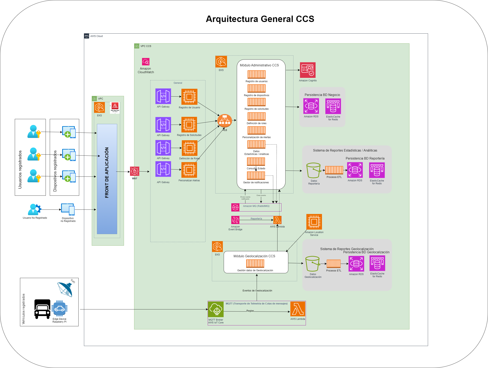

<!-- Agregar la Descripción detallada del API. -->
#### Descripción Funcional Detallada
Permitir el monitoreo de rutas de vehículos para diversas compañías. Adicionalmente puedes configurar usuarios, dispositivos, definir roles y visualizar análiticas de todo los eventos relativos a las rutas recorridas, recibir alertas en tiempo real sobre eventos con el vehículo así como la carga 

### Diagramas de concepto
En los siguientes diagramas se presentan de forma muy general los distintos alcances planteados en el ejercicio

### Diagrama de Arquitectura
A continuación se presenta la arquitectura planteada como MVP

Las funciones que los componentes proveen al servicio se relacionan en la siguiente tabla:

|Componente|Función|
|-|-|
|VPC|Amazon Virtual Private Cloud (Amazon VPC) brinda control total sobre el entorno de redes virtuales, incluidas la ubicación de los recursos, la conectividad y la seguridad.|
|AWS Amplify|Es un conjunto de herramientas y servicios que permiten a los desarrolladores de Front End (web y móviles) crear aplicaciones seguras y escalables full-stack, con tecnología desarrolada por Utilizaremos Amplify para la integración de Front End con APIs y servicios de autenticación|
|AWS Lambda|Permite ejecutar código sin aprovisionar ni administrar servidores. Utilizaremos Lambda en dos puntos de la aplicación. El primero será el procesamiento de la información recibida a través de IoT Core y el envío a Location Service. El segundo punto es para procesar llamadas API y consultar Location Service para el seguimiento de la información.|
|Edge Device|Este dispositivo es responsable de capturar datos de geolocalización (latitud, longitud y fecha/hora), y la transmisión a la nube utilizando Internet como medio físico, organizando los datos por medio del protocolo MQTT (Message Queue Telemetry Transport – https://mqtt.org/). Utilizaremos la Raspberry Pi para procesar y filtrar los datos procedentes del GPS conectado a una puerta serie USB y enviarlos a la nube a través del protocolo MQTT|
|GPS|El sistema de posicionamiento global, más conocido por las siglas GPS, es un sistema de navegación por satélite que proporciona a un receptor móvil su posición, así como la hora, en cualquier condición meteorológica, en cualquier momento y en cualquier lugar de la Tierra; siempre que el receptor se encuentre en el campo de visión de tres satélites GPS|
|MQTT|MQTT es un protocolo de mensajería estándar de OASIS para Internet de las cosas (IoT). Está diseñado como un transporte de mensajería de publicación/suscripción extremadamente liviano que es ideal para conectar dispositivos remotos con una huella de código pequeña y un ancho de banda de red mínimo. MQTT hoy en día se utiliza en una amplia variedad de industrias, como la automotriz, manufacturera, de telecomunicaciones, de petróleo y gas, etc. MQTT facilita el cifrado de mensajes mediante TLS y la autenticación de clientes mediante protocolos de autenticación modernos, como OAuth|
|Broker MQTT y almacenamiento de datos|Utilizaremos AWS IoT Core en la función de broker de MQTT (servicio para recibir datos de geolocalización) y por medio de sus reglas enviaremos los datos para su procesamiento a AWS Lambda. La función Lambda será responsable de recibir los eventos y enviarlos a Location Service.|
|AWS IoT Core|Ofrece servicios y soluciones del Internet de las cosas (IoT) para conectar y administrar dispositivos. Los servicios de AWS IoT atienden cada capa de la seguridad de las aplicaciones y dispositivos. Proteje los datos de los dispositivos con mecanismos preventivos, como el cifrado y el control de acceso. Además, permite auditar y monitorear constantemente las configuraciones con AWS IoT Device Defender.|
|WAF|Es un firewall de aplicaciones web (WAF) que protege a las aplicaciones web de diversos ataques a la capa de aplicación, como el cross-site scripting (XSS), la inyección de SQL y el poisoning de cookies, entre otros|
|API Gateway|Es un servicio completamente administrado que facilita la creación, la publicación, el mantenimiento, el monitoreo y la protección de APIs a cualquier escala. Con API Gateway, se pueden crear API RESTful y API WebSocket que permiten aplicaciones de comunicación bidireccional en tiempo real. API Gateway admite cargas de trabajo en contenedores y sin servidor, así como aplicaciones web.|
|EKS|Amazon Elastic Kubernetes Service (Amazon EKS) es un servicio administrado por Kubernetes que sirve para ejecutar Kubernetes en la nube de AWS y en centros de datos locales. En la nube, Amazon EKS administra de forma automática la disponibilidad y la escalabilidad de los nodos del plano de control de Kubernetes responsables de programar contenedores, administrar la disponibilidad de las aplicaciones, almacenar datos de clústeres y otras tareas clave|
|Amazon Cognito| Permite agregar funciones de registro e inicio de sesión para los usuarios y controlar el acceso a las aplicaciones web y móviles. Brinda un almacenamiento de identidades escalable, respalda la federación de identidades social y empresarial, y ofrece funciones de seguridad avanzada.|
|Amazon S3|Amazon Simple Storage Service es un servicio de almacenamiento de objetos que ofrece escalabilidad, disponibilidad de datos, seguridad y rendimiento.|
|Amazon ElastiCache para Redis|Funciona como almacén de datos en memoria para abastecer a las aplicaciones más exigentes que requieren tiempos de respuesta inferiores a un milisegundo. A diferencia de las bases de datos basadas en discos, en las que la mayoría de las operaciones necesitan ir y volver al disco, los almacenes de datos en memoria administran los datos en memoria, que es mucho más rápido que hacerlo en discos, el resultado es un desempeño increíblemente rápido|
|ALB|Elastic Load Balancing distribuye automáticamente el tráfico entrante entre varios destinos, por ejemplo, instancias EC2, contenedores y direcciones IP en una o varias zonas de disponibilidad. Monitorea el estado de los destinos registrados y enruta el tráfico solamente a destinos en buen estado. Elastic Load Balancing escala el equilibrador de carga a medida que el tráfico entrante va cambiando con el tiempo. Puede escalarse automáticamente para adaptarse a la mayoría de las cargas de trabajo|
|Amazon EventBridge|Es un servicio sin servidor que utiliza eventos para conectar los componentes de la aplicación entre sí, lo que facilita la creación de aplicaciones escalables basadas en eventos.|
|Amazon Location Service|Es un servicio que permite agregar fácilmente características como mapas, puntos de interés, geocodificación, enrutamiento, geovallas y seguimiento a aplicaciones. Utilizaremos Location Service para mostrar mapas en front end y almacenar información de seguimiento de vehículos.|

### Escenarios de prueba BDD
Para la descripción de los escenarios de pruebas usamos la metodología BDD (Behavior Driven Development), a continuación se presentan los escenarios planteados

### Capacidades pertenecientes a la API
<!-- Estos enlaces deben ser enlaces a las operaciones en la carpeta mapeos -->
* [retrieveTerms](mapeos/#retrieveTerms "ver capacidad")
* [prepareTransaction](mapeos/#prepareTransaction "ver capacidad")
* [retrieveStatusTransaction](mapeos/#retrieveStatusTransaction "ver capacidad")

## Estándares soportados

- **OAS** (Version 2.0): Estándar de especificación de la API.
- **JSON** (vnd.bancolombia.v4+json): Estándar de mensajeria que define la estructura de la API.

## Contrato

<!-- Conservar esta etiqueta, el link del contrato se asignará en tiempo de construcción del sitio -->
<a href="contrato.txt" download>Descargar</a>

## Modelo de componentes


Las funciones que los componentes proveen al servicio se relacionan en la siguiente tabla:

|Componente|Función|Estilo de Interacción|Estilo Técnico Comunicación|
|-|-|-|-|
|FinancialGatewayCashIn|Es el componente donde se implementa la lógica de la API, donde se realizan validaciones de campos y las transformaciones de mensajería para la solicitud y respuesta del servicio|Request/Response|Síncrono|
|API Connect - Analytics|Es la aplicación que se encarga de registrar los consumos y de generar datos de analítica a las APIs en API Connect.|Request/Response|Síncrono|

### Analytics
Subsistema que administra:

- Eventos de las API´s
- Tableros e Indicadores
- Reportes de Visualización

**Estilo de interacción**: Request/Response
**Estilo Técnico Comunicación**: Síncrono

### PrepararTransaccion
PrepararTransaccion Permite a un comercio adelantar el proceso de preparación para la recarga del monedero digital. Orquestando los reúsos correspondientes para validar las condiciones requeridas para realizar la transacción correctamente

- **Estilo de interacción**: Request/Response
- **Estilo Técnico Comunicación**: Asíncrono

## Vista técnica

### Diagrama técnico
En esta vista se muestran componentes implementados en unidades de despliegue del API.



### Características técnicas
Características técnicas relevantes y asociadas a los componentes, están relacionadas en la siguiente tabla:

- **Consideraciones de seguridad**: Autorización de consumo a través de API Key (client-Id, Client-Secret) sumado a JWT.

## Trazabilidad del API
En la siguiente tabla se selecciona el nivel de trazabilidad de los mensajes para cada una de las operaciones del API:

|Operación|Cabecera|Carga útil|Mensaje completo|System Exception|
|:-:|:-:|:-:|:-:|:-:|
|retrieveTerms (POST)|X|X||X|
|prepareTransaction (POST)|X|X||X|
|retrieveStatusTransaction (POST)|X|X||X|

### Plataforma de despliegue del API
Se requiere que la API sea expuesta en un ambiente estable y con la mayor cantidad de capacidades.

Alternativas:
- API Connect v10
- API Connect v5
- IBM Cloud

Decisión:
- API Connect v10

Implicaciones: La API se expone en un ambiente contenerizado.

### Espacio de API Connect
Se requiere definir el espacio en que será expuesta la API, el cual está asociado a la línea de negocio **EVC BAAS01/BancolombiaPay**.

Decisión:
- **EVC BAAS01/BancolombiaPay**

Implicaciones: La API queda asociada a la infraestructura especifica del **EVC BAAS01/BancolombiaPay**.

## Link al repositorio de código
<!-- Reemplazar por el link al código fuente del componente en azure devops -->
<a href="https://grupobancolombia.visualstudio.com/Vicepresidencia%20Servicios%20de%20Tecnolog%C3%ADa/_git/NU2660001_Financial_Institutions_External_APIC10" target="_blank">Código fuente</a>
