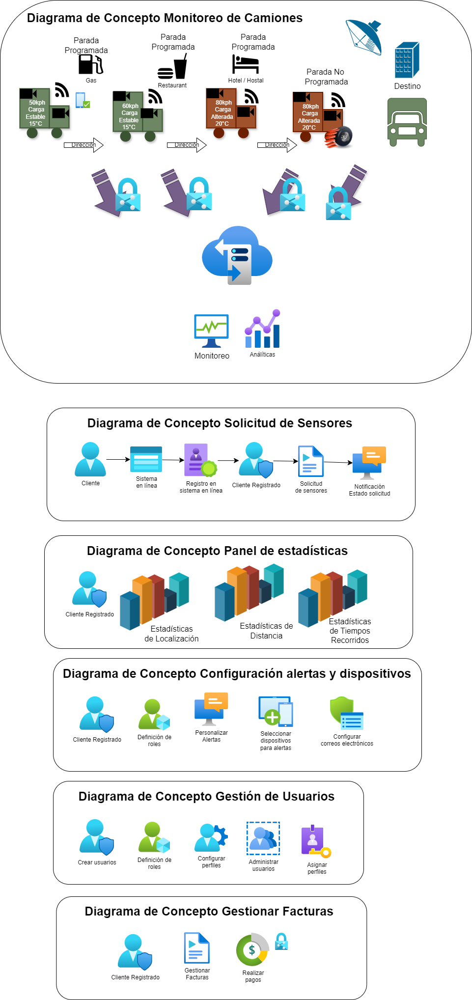

<!-- Agregar la Descripción detallada del API. -->
#### Descripción Funcional Detallada
Permitir el monitoreo de rutas de vehículos para diversas compañías. Adicionalmente puedes configurar usuarios, dispositivos, definir roles y visualizar análiticas de todo los eventos relativos a las rutas recorridas, recibir alertas en tiempo real sobre eventos con el vehículo así como la carga 

### Diagramas de concepto

* #En los siguientes diagramas se presentan de forma muy general los distintos alcances planteados en el ejercicio

### Diagrama de Arquitectura

### Versión
1.0.0

### Capacidades pertenecientes a la API
<!-- Estos enlaces deben ser enlaces a las operaciones en la carpeta mapeos -->
* [retrieveTerms](mapeos/#retrieveTerms "ver capacidad")
* [prepareTransaction](mapeos/#prepareTransaction "ver capacidad")
* [retrieveStatusTransaction](mapeos/#retrieveStatusTransaction "ver capacidad")

## Estándares soportados

- **OAS** (Version 2.0): Estándar de especificación de la API.
- **JSON** (vnd.bancolombia.v4+json): Estándar de mensajeria que define la estructura de la API.

## Contrato

<!-- Conservar esta etiqueta, el link del contrato se asignará en tiempo de construcción del sitio -->
<a href="contrato.txt" download>Descargar</a>

## Modelo de componentes


Las funciones que los componentes proveen al servicio se relacionan en la siguiente tabla:

|Componente|Función|Estilo de Interacción|Estilo Técnico Comunicación|
|-|-|-|-|
|FinancialGatewayCashIn|Es el componente donde se implementa la lógica de la API, donde se realizan validaciones de campos y las transformaciones de mensajería para la solicitud y respuesta del servicio|Request/Response|Síncrono|
|API Connect - Analytics|Es la aplicación que se encarga de registrar los consumos y de generar datos de analítica a las APIs en API Connect.|Request/Response|Síncrono|

### Analytics
Subsistema que administra:

- Eventos de las API´s
- Tableros e Indicadores
- Reportes de Visualización

**Estilo de interacción**: Request/Response
**Estilo Técnico Comunicación**: Síncrono

### PrepararTransaccion
PrepararTransaccion Permite a un comercio adelantar el proceso de preparación para la recarga del monedero digital. Orquestando los reúsos correspondientes para validar las condiciones requeridas para realizar la transacción correctamente

- **Estilo de interacción**: Request/Response
- **Estilo Técnico Comunicación**: Asíncrono

## Vista técnica

### Diagrama técnico
En esta vista se muestran componentes implementados en unidades de despliegue del API.



### Características técnicas
Características técnicas relevantes y asociadas a los componentes, están relacionadas en la siguiente tabla:

- **Consideraciones de seguridad**: Autorización de consumo a través de API Key (client-Id, Client-Secret) sumado a JWT.

## Trazabilidad del API
En la siguiente tabla se selecciona el nivel de trazabilidad de los mensajes para cada una de las operaciones del API:

|Operación|Cabecera|Carga útil|Mensaje completo|System Exception|
|:-:|:-:|:-:|:-:|:-:|
|retrieveTerms (POST)|X|X||X|
|prepareTransaction (POST)|X|X||X|
|retrieveStatusTransaction (POST)|X|X||X|

### Plataforma de despliegue del API
Se requiere que la API sea expuesta en un ambiente estable y con la mayor cantidad de capacidades.

Alternativas:
- API Connect v10
- API Connect v5
- IBM Cloud

Decisión:
- API Connect v10

Implicaciones: La API se expone en un ambiente contenerizado.

### Espacio de API Connect
Se requiere definir el espacio en que será expuesta la API, el cual está asociado a la línea de negocio **EVC BAAS01/BancolombiaPay**.

Decisión:
- **EVC BAAS01/BancolombiaPay**

Implicaciones: La API queda asociada a la infraestructura especifica del **EVC BAAS01/BancolombiaPay**.

## Link al repositorio de código
<!-- Reemplazar por el link al código fuente del componente en azure devops -->
<a href="https://grupobancolombia.visualstudio.com/Vicepresidencia%20Servicios%20de%20Tecnolog%C3%ADa/_git/NU2660001_Financial_Institutions_External_APIC10" target="_blank">Código fuente</a>
