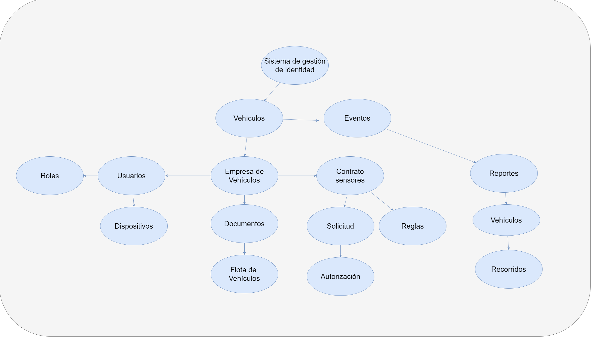
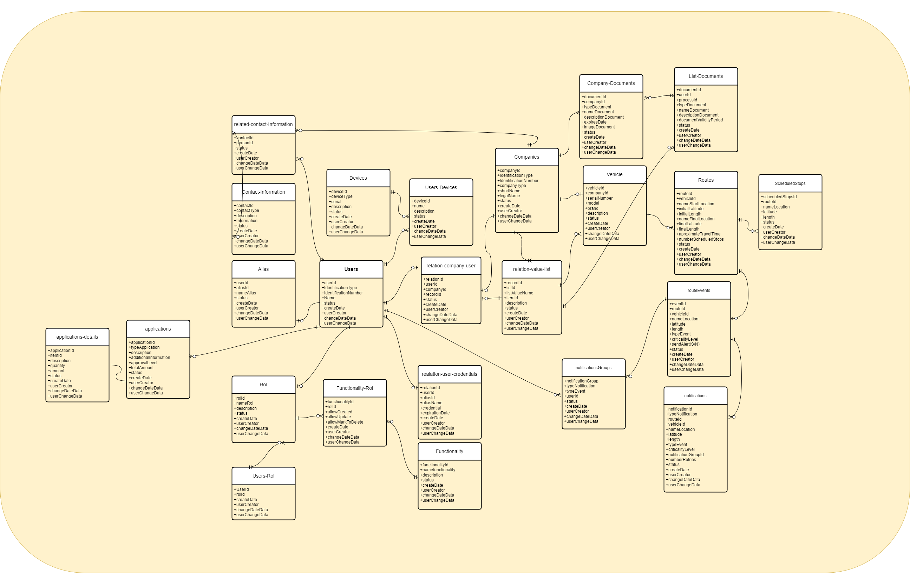
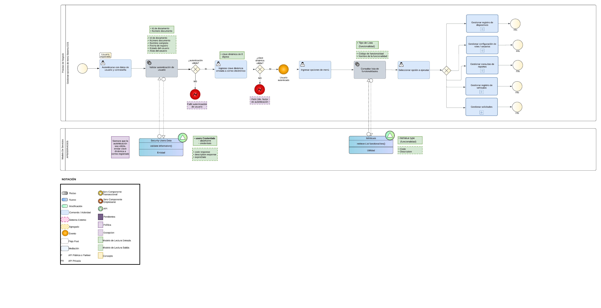
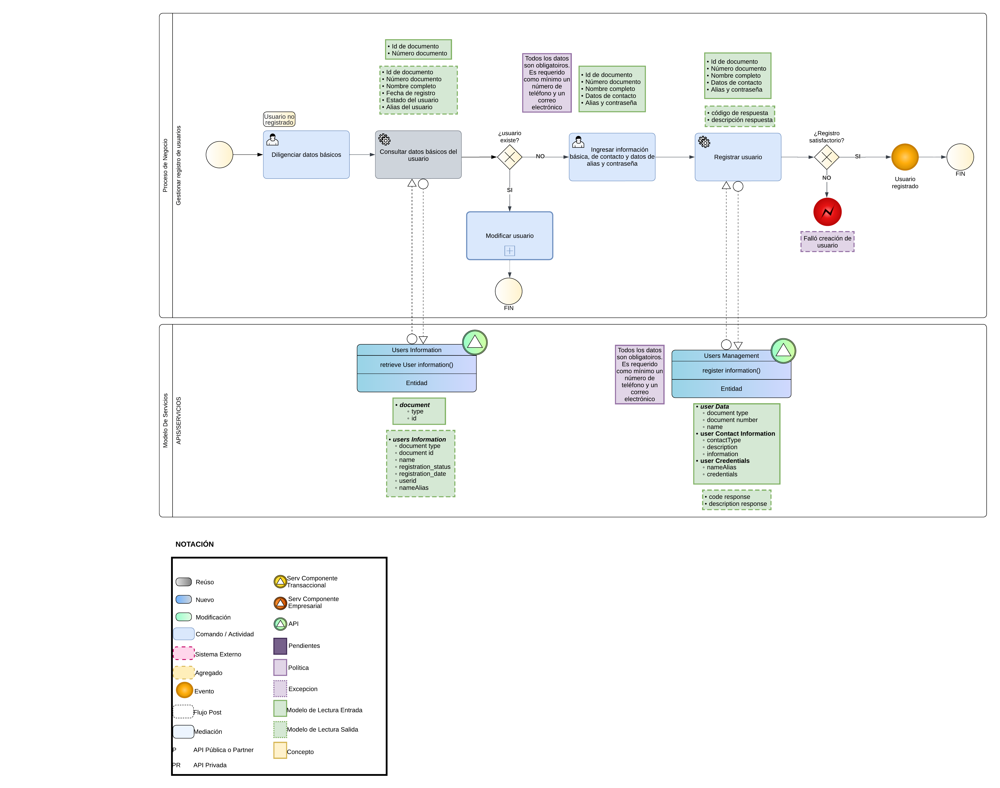
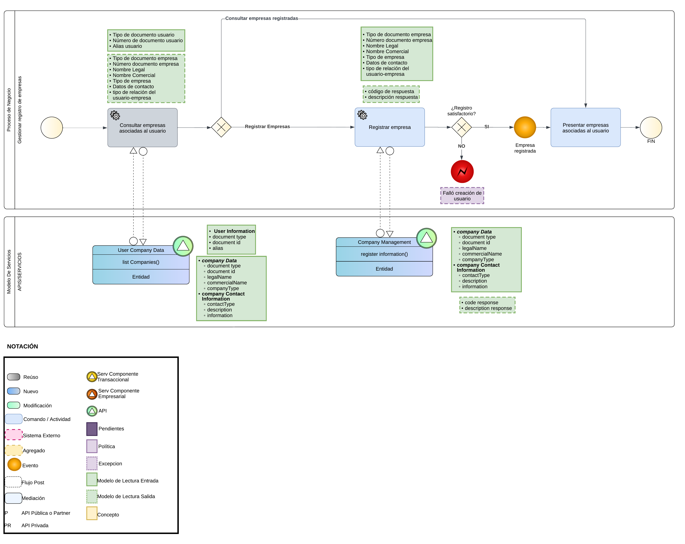
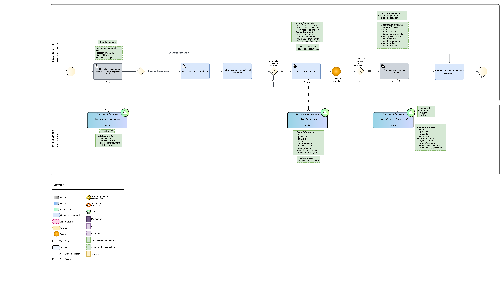
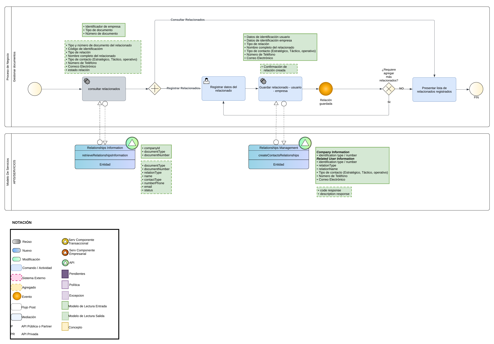
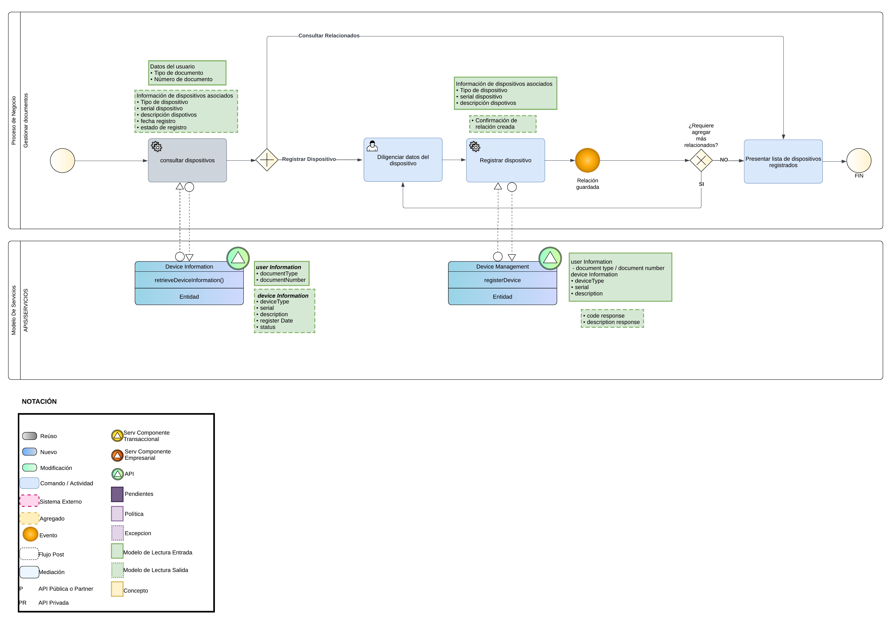

<!-- Agregar la Descripción detallada del API. -->
## Descripción Funcional Detallada
Permitir el monitoreo de rutas de vehículos para diversas compañías. Adicionalmente puedes configurar usuarios, dispositivos, definir roles y visualizar análiticas de todo los eventos relativos a las rutas recorridas, recibir alertas en tiempo real sobre eventos con el vehículo así como la carga 

### Diagramas de concepto
En los siguientes diagramas se presentan de forma muy general los distintos alcances planteados en el ejercicio

### Diagrama de Arquitectura
A continuación se presenta la arquitectura planteada como MVP

Las funciones que los componentes proveen al servicio se relacionan en la siguiente tabla:

|Componente|Función|
|-|-|
|VPC|Amazon Virtual Private Cloud (Amazon VPC) brinda control total sobre el entorno de redes virtuales, incluidas la ubicación de los recursos, la conectividad y la seguridad.|
|AWS Amplify|Es un conjunto de herramientas y servicios que permiten a los desarrolladores de Front End (web y móviles) crear aplicaciones seguras y escalables full-stack, con tecnología desarrolada por Utilizaremos Amplify para la integración de Front End con APIs y servicios de autenticación|
|AWS Lambda|Permite ejecutar código sin aprovisionar ni administrar servidores. Utilizaremos Lambda en dos puntos de la aplicación. El primero será el procesamiento de la información recibida a través de IoT Core y el envío a Location Service. El segundo punto es para procesar llamadas API y consultar Location Service para el seguimiento de la información.|
|Edge Device|Este dispositivo es responsable de capturar datos de geolocalización (latitud, longitud y fecha/hora), y la transmisión a la nube utilizando Internet como medio físico, organizando los datos por medio del protocolo MQTT (Message Queue Telemetry Transport – https://mqtt.org/). Utilizaremos la Raspberry Pi para procesar y filtrar los datos procedentes del GPS conectado a una puerta serie USB y enviarlos a la nube a través del protocolo MQTT|
|GPS|El sistema de posicionamiento global, más conocido por las siglas GPS, es un sistema de navegación por satélite que proporciona a un receptor móvil su posición, así como la hora, en cualquier condición meteorológica, en cualquier momento y en cualquier lugar de la Tierra; siempre que el receptor se encuentre en el campo de visión de tres satélites GPS|
|MQTT|MQTT es un protocolo de mensajería estándar de OASIS para Internet de las cosas (IoT). Está diseñado como un transporte de mensajería de publicación/suscripción extremadamente liviano que es ideal para conectar dispositivos remotos con una huella de código pequeña y un ancho de banda de red mínimo. MQTT hoy en día se utiliza en una amplia variedad de industrias, como la automotriz, manufacturera, de telecomunicaciones, de petróleo y gas, etc. MQTT facilita el cifrado de mensajes mediante TLS y la autenticación de clientes mediante protocolos de autenticación modernos, como OAuth|
|Broker MQTT y almacenamiento de datos|Utilizaremos AWS IoT Core en la función de broker de MQTT (servicio para recibir datos de geolocalización) y por medio de sus reglas enviaremos los datos para su procesamiento a AWS Lambda. La función Lambda será responsable de recibir los eventos y enviarlos a Location Service.|
|AWS IoT Core|Ofrece servicios y soluciones del Internet de las cosas (IoT) para conectar y administrar dispositivos. Los servicios de AWS IoT atienden cada capa de la seguridad de las aplicaciones y dispositivos. Proteje los datos de los dispositivos con mecanismos preventivos, como el cifrado y el control de acceso. Además, permite auditar y monitorear constantemente las configuraciones con AWS IoT Device Defender.|
|WAF|Es un firewall de aplicaciones web (WAF) que protege a las aplicaciones web de diversos ataques a la capa de aplicación, como el cross-site scripting (XSS), la inyección de SQL y el poisoning de cookies, entre otros|
|API Gateway|Es un servicio completamente administrado que facilita la creación, la publicación, el mantenimiento, el monitoreo y la protección de APIs a cualquier escala. Con API Gateway, se pueden crear API RESTful y API WebSocket que permiten aplicaciones de comunicación bidireccional en tiempo real. API Gateway admite cargas de trabajo en contenedores y sin servidor, así como aplicaciones web.|
|EKS|Amazon Elastic Kubernetes Service (Amazon EKS) es un servicio administrado por Kubernetes que sirve para ejecutar Kubernetes en la nube de AWS y en centros de datos locales. En la nube, Amazon EKS administra de forma automática la disponibilidad y la escalabilidad de los nodos del plano de control de Kubernetes responsables de programar contenedores, administrar la disponibilidad de las aplicaciones, almacenar datos de clústeres y otras tareas clave|
|Amazon Cognito| Permite agregar funciones de registro e inicio de sesión para los usuarios y controlar el acceso a las aplicaciones web y móviles. Brinda un almacenamiento de identidades escalable, respalda la federación de identidades social y empresarial, y ofrece funciones de seguridad avanzada.|
|Amazon S3|Amazon Simple Storage Service es un servicio de almacenamiento de objetos que ofrece escalabilidad, disponibilidad de datos, seguridad y rendimiento.|
|Amazon ElastiCache para Redis|Funciona como almacén de datos en memoria para abastecer a las aplicaciones más exigentes que requieren tiempos de respuesta inferiores a un milisegundo. A diferencia de las bases de datos basadas en discos, en las que la mayoría de las operaciones necesitan ir y volver al disco, los almacenes de datos en memoria administran los datos en memoria, que es mucho más rápido que hacerlo en discos, el resultado es un desempeño increíblemente rápido|
|ALB|Elastic Load Balancing distribuye automáticamente el tráfico entrante entre varios destinos, por ejemplo, instancias EC2, contenedores y direcciones IP en una o varias zonas de disponibilidad. Monitorea el estado de los destinos registrados y enruta el tráfico solamente a destinos en buen estado. Elastic Load Balancing escala el equilibrador de carga a medida que el tráfico entrante va cambiando con el tiempo. Puede escalarse automáticamente para adaptarse a la mayoría de las cargas de trabajo|
|Amazon EventBridge|Es un servicio sin servidor que utiliza eventos para conectar los componentes de la aplicación entre sí, lo que facilita la creación de aplicaciones escalables basadas en eventos.|
|Amazon Location Service|Es un servicio que permite agregar fácilmente características como mapas, puntos de interés, geocodificación, enrutamiento, geovallas y seguimiento a aplicaciones. Utilizaremos Location Service para mostrar mapas en front end y almacenar información de seguimiento de vehículos.|

### Diagrama de dominios y de Entidad-Relación
Para la definición del modelo de entidad-relación, primero realicé un ejercicio de DDD (Domain Driven Design) donde identifiqué los principales dominios del negocio, posteriormente realicé el diagrama del modelo de entidad relación donde se detalla más claramente la interrelación entre los dominios. Posteriormente en los flujos BPMN se completó el ejercicio DDD con event storming

#### Diagrama de Dominios

#### Diagrama Entidad-Relación

#### Escenarios de prueba BDD
Para la descripción de los escenarios de pruebas usamos la metodología BDD (Behavior Driven Development), a continuación se presentan los escenarios planteados

### Blue Prints de Servicios
A continuación presentamos los blue prints de servicios identificados

* BP Gestionar Sistema CCS: Este blue print presenta el flujo de autenticación de un usuario en el sistema y las opciones de menú a las que puede acceder

* BP Gestionar registro de usuarios: Este blue print presenta el flujo de registro de un usuario nuevo, para crear credenciales en el sistema

* BP Gestionar registro de  empresas: Este blue print presenta el flujo de creación de una empresa

* BP Gestionar documentos: Este blue print presenta el flujo de registro de documentos de una empresa

* BP Gestionar relacionados: Este blue print presenta el flujo de registro de usuarios y relacionados de una empresa

* BP Gestionar relacionados: Este blue print presenta el flujo de registro de usuarios y relacionados de una empresa

* BP Gestionar dispositivos: Este blue print presenta el flujo de registro de dispositivos de confianza del usuario

### Consideraciones Código Limpio
Se recomienda seguir las pautas de desarrollo bajo código limpio. Los principios del código limpio son los siguientes:

#### La regla del boy scout: 
Cuando estás trabajando en un software, trata de mejorar tu entorno de trabajo siempre que sea posible, tal como lo hacen los boy scout con el medio ambiente. Por ejemplo, puedes cambiar el nombre de una variable confusa, dividir una tarea en funciones reutilizables, separar responsabilidades en diferentes partes del código, o cualquier otra acción que mejore tu flujo de trabajo.

* Nombres con sentido: 
Los nombres de variables y funciones deben ser descriptivos y claros para que cualquier persona que lea el código pueda comprender fácilmente su propósito y su función dentro del programa. Las reglas de nombres de variables establecen que estas deben ser sustantivos y describir claramente su propósito en el contexto del código. Es decir, el nombre de una variable debe indicar qué representa o qué almacena dentro del programa. También dependiendo del tipo de dato podemos expresar nombres en plural o singular.

|Objeto|Regla|Incorrecto|Correcto|
|:-:|:-:|:-:|:-:|
|Variables|Las reglas de nombres de variables establecen que estas deben ser sustantivos y describir claramente su propósito en el contexto del código. Es decir, el nombre de una variable debe indicar qué representa o qué almacena dentro del programa. También dependiendo del tipo de dato podemos expresar nombres en plural o singular|temp, tall, fruits_list|temperature, is_tall, fruits_names|
|Funciones|Los métodos o funciones deben ser nombrados con verbos que describan claramente lo que hacen. Es importante que el nombre de la función refleje su propósito y la acción que realiza dentro del programa. Por ejemplo, en lugar de nombres genéricos o ambiguos, como “calcular” o “procesar”, es preferible utilizar nombres descriptivos que indiquen específicamente la tarea que realiza la función. Esto ayuda a mejorar la comprensión del código y facilita su mantenimiento a largo plazo. A su vez, los parámetros de entrada deben ser descriptivos.|upload, create|upload_file, create_user|
|Clases|Cuando se nombran clases en programación, es importante utilizar sustantivos o frases de nombres que describan claramente su propósito y función en el programa. Evita nombres genéricos como “Data” o “Loader”, ya que no transmiten información suficiente sobre el propósito de la clase.|Convert, Parse|ConvertPDF, XMLParse|

Al nombrar variables, métodos o cualquier otro elemento en programación, se deben seguir las siguientes reglas generales:
- Los nombres deben ser pronunciables, es decir, fáciles de decir y entender para cualquier persona que lea el código.
- Los nombres deben ser lo más precisos posible y describir con exactitud el propósito o función del elemento.
- Evitar utilizar codificaciones, prefijos o sufijos en los nombres, como añadir “Txt” a una variable de texto o prefijos como “var” o “_” al principio de un nombre. Esto puede hacer que el código sea más difícil de entender y mantener en el futuro. Es mejor utilizar nombres descriptivos que indiquen claramente el propósito del elemento.

#### Reglas de consistencia.
Cuando estamos programando, podemos utilizar diferentes nombres para acciones similares. Por ejemplo, si queremos obtener información sobre un usuario u otra entidad, podríamos usar palabras como “get”, “retrieve”, “fetch”, entre otras. Todas estas opciones son válidas y pueden funcionar bien. Sin embargo, es importante elegir una de estas opciones y mantenerla consistente en todo el proyecto. Esto significa que una vez que hayamos decidido utilizar, por ejemplo, “get” para obtener información, todas las demás acciones de obtener información deben seguir esta misma nomenclatura. Esto ayuda a mantener el código claro y coherente, facilitando la comprensión y el mantenimiento del proyecto a medida que crece.

#### Reglas para funciones.
Es importante que las funciones sigan ciertas reglas para mantener el código en un estado óptimo:
- Responsabilidad única en la función: Una función debe tener una sola responsabilidad. Si una función tiene más de una tarea, es mejor dividirla en funciones más pequeñas, cada una encargada de una única responsabilidad. Siguiendo este principio, podemos asegurarnos de que nuestras funciones sean más fáciles de entender, probar y mantener a largo plazo. Además, nos permite reutilizar estas funciones en diferentes partes de nuestro programa, lo que mejora la modularidad y la legibilidad del código en general.
- Evitar definir múltiples parámetros en la función: Cuantos más parámetros tenga una función, más complejo será su uso y comprensión. Limitar el número de parámetros simplifica la interfaz de la función y hace que sea más fácil de entender y utilizar. Si una función requiere muchos parámetros, debemos pensar en encapsularlos por medio de alguna interfaz o algún objeto. Una sugerencia es que la función no debe tener más de 3 parámetros, caso contrario debemos reducir a 1.

#### Reglas para comentarios.
- Evitar comentarios de marcadores posicionales: Los comentarios posicionales son comentarios que separan secciones dentro del código. Estos marcadores no aportan ningún valor útil.
- Eliminar código comentado: El código comentado solamente ensucia el entorno de trabajo. Hoy en día ya tenemos versionamiento de código como lo es Git para poder recuperar código escrito con anterioridad.

#### No agregar contexto innecesario.
El principio “No agregue contexto innecesario” se trata de mantener el código simple y fácil de entender al eliminar información que no sea necesaria para comprender o utilizar el código de manera efectiva. Esto implica evitar agregar detalles irrelevantes o excesivos que no contribuyan a la funcionalidad o claridad del código. Para aplicar este principio, es importante elegir nombres apropiados para las variables, clases, métodos y otros elementos del código. Asegúrate de que estos nombres sean claros y breves, evitando repetir información que ya es evidente según el contexto.

Adicionalmente, en el campo del desarrollo de software, existen varios acrónimos que resumen principios prácticos fundamentales que complementan los principios de Clean Code y están estrechamente relacionados. Algunos de estos acrónimos sonlos siguientes:

#### DRY — “Don’t Repeat Yourself”.
Cuando aplicas el principio DRY, buscas eliminar la repetición de código escribiendo cada pieza de lógica o funcionalidad solo una vez y reutilizándola cuando sea necesario en lugar de copiar y pegar el mismo código en múltiples lugares. Algunas pautas que sirven de guía para saber si no estamos aplicando el principio DRY:
- Copiar y pegar código
- Múltiples versiones de lógica similar
- Valores mágicos o literales repetidos
- Redundancia en estructuras de control
- Reglas de negocio duplicadas
- Exceso de parámetros en funciones

#### KISS — “Keep It Simple, Stupid”.
Este principio es una guía de diseño y desarrollo que aboga por la simplicidad como un objetivo clave en el diseño de sistemas y la escritura de código. El principio KISS se puede aplicar de varias maneras en el contexto del desarrollo de software:
- Escritura de código: Se recomienda escribir código claro, legible y conciso, utilizando nombres de variables y funciones descriptivos, evitando la duplicación de código y manteniendo la estructura y la lógica lo más simple posible.
- Mantenimiento y escalabilidad: Un código más simple es más fácil de mantener, depurar y actualizar en el futuro. Además, un diseño simple suele ser más flexible y adaptable a cambios y requisitos futuros.

#### YAGNI — “You Aren’t Gonna Need It”.
Este principio se utiliza en el desarrollo de software y en la ingeniería de software para enfatizar que no debes agregar funcionalidades o escribir código que no sea necesario en el momento actual. En lugar de anticipar posibles necesidades futuras y agregar funcionalidades complejas de manera especulativa, se enfoca en implementar solo lo que se necesita en el momento presente para cumplir con los requisitos del proyecto.

### Realizar pruebas enfocadas en TDD
El desarrollo guiado por pruebas (TDD) es fundamental para agilizar los procesos de desarrollo de software. Aplicada correctamente, TDD contribuye a crear un código más fiable y flexible, promoviendo soluciones escalables y de alta calidad mediante la automatización. A continuación, describimos algunas buenas prácticas para la aplicación de TDD.

- Tests pequeños y focalizados. Cada test debe centrarse en un único aspecto o funcionalidad. Esto hace que los tests sean más fáciles de escribir, entender y mantener. 

- Claridad y limpieza. Los tests deben ser claras y legibles, actuando como documentación viva del sistema. Deben explicar el propósito y el uso esperado de las unidades de código para la comprensión y el mantenimiento a largo plazo.

- Denominación de los tests. Los nombres de los tests deben ser descriptivos y reflejar lo que están probando. Esto puede ayudar a otros a entender el propósito de la prueba y qué aspecto del código se está validando.

- Refactorización. La refactorización no se aplica solo al código de producción; los tests también deben ser objeto de refactorización para mejorar su claridad y eficiencia.

- Frecuencia. Los tests deben ejecutarse tan a menudo como sea posible, idealmente de forma automática mediante la integración continua, para proporcionar retroalimentación rápida sobre los cambios en el código.

- Tests independientes. Cada test debe ser independiente y no depender de otros. Esto asegura que pueden ejecutarse en cualquier orden y que el fallo de un test no afecta a los demás. Por ello, es conveniente ejecutar todos los tests cuando se añade un comportamiento nuevo (en la fase Green) porque pasar el último test no significa que no exista un error en otra parte. De esta manera nos aseguramos que no se ha introducido ningún error de regresión.

- Sencillez. Los tests deben ser simples y evitar contener lógica condicional o bucles, ya que esto puede introducir errores en los propios tests y hacerlos más difíciles de comprender y mantener.

- Disciplina. Mantenerse fiel al ciclo de TDD (Red, Green, Refactor) y resistir la tentación de saltarse pasos o escribir código sin una prueba fallida previa. Esto asegura que el proceso de TDD se mantenga efectivo.

- Pair programming. Implementar TDD en parejas te ayuda a obtener feedback inmediato sobre los tests y su comportamiento. Al aplicar pair programming mejorarás tus capacidades gracias al intercambio positivo y constructivo de ideas. 